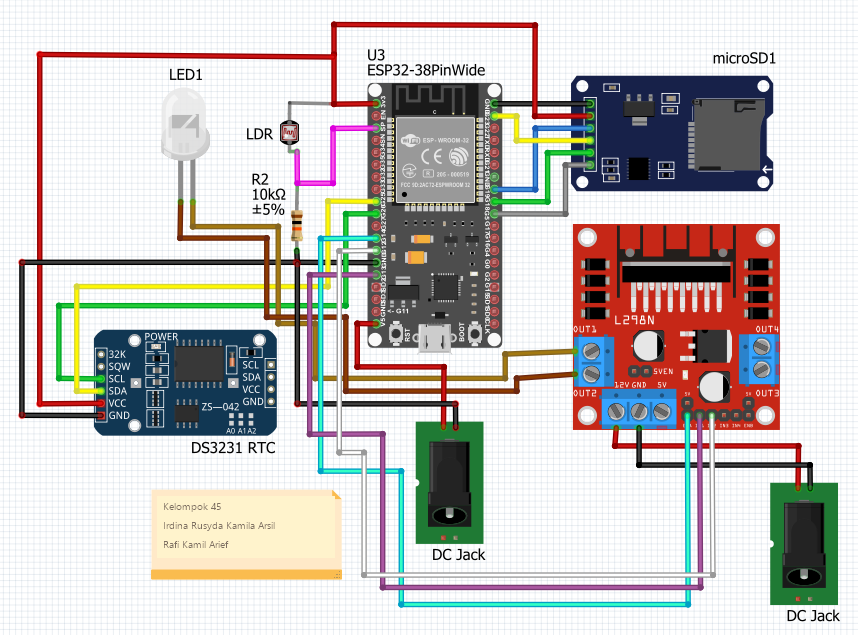
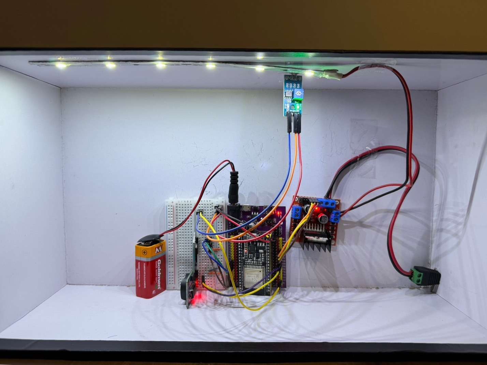

# ESP32 PWM Chicken-Coop Lighting

ESP32 PWM lighting project using LDR feedback, a DS3231 real-time clock, an
L298N driver, and microSD data logging.

## Repository structure

- `firmware/pwm_chicken_coop_lighting/`: final sketch.
- `experiments/`: prototype and RTC test.
- `hardware/wiring_diagram.png`: Fritzing wiring view.
- `hardware/pwm_chicken_coop_lighting.fzz`: editable Fritzing project.
- `hardware/prototype.jpg`: hardware photograph.

## Main pin mapping

| Function | ESP32 pin |
|---|---:|
| LDR analog input | GPIO 36 |
| L298N IN1 / IN2 / ENA | GPIO 13 / GPIO 12 / GPIO 14 |
| microSD chip select | GPIO 5 |
| DS3231 SDA / SCL | GPIO 25 / GPIO 26 |

The sketch uses the ESP32 Arduino core, `FS`, `SD`, `SPI`, `Wire`, and
Adafruit `RTClib`.
